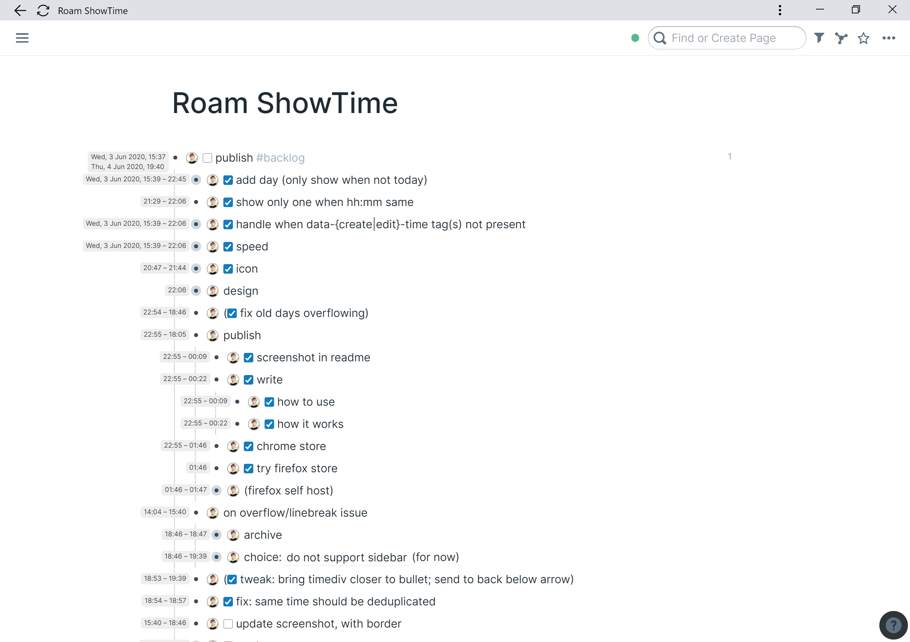

# Roam ShowTime

- 🚀 Update 2022. A subset of this functionality is now built-in in Roam. (Hover over a bullet to see the last edited time).
- ⚠ Update Jan 2021. Another Roam update broke this plugin. I have no plans to update this plugin further. PRs are welcome though.

---

Browser extension to show block creation & edit times on [Roam Research](https://roamresearch.com).

What it looks like:

This is useful when reviewing how much time you spent on a topic/thought/task.

### Instructions for use

- Toggle the time display using `ctrl-c, ctrl-s`.
  - Note that this shortcut changed (it used to be `ctrl-c, ctrl-x`).
- The first entry is the creation time, the second the time of last edit.
- If those are the same (ignoring seconds), only one is displayed
- For times more than 24 hours in the past, the full date is displayed.

Note that the displayed times concern the block text only 
(and not any descendant blocks).

⏱ When a lot of blocks are loaded on the page, the app will start to respond 
slowly. Toggling off the time display while you are interacting with blocks 
will then help.

🎨 If you use custom CSS on Roam that drastically changes the layout, this 
plugin might well clash with it. Smaller theming changes should be fine.

### Installation

- Installation from the Chrome webstore auto-updates.
  (Note however that there's a review delay whenever a new version is uploaded to the webstore).
- For Firefox, download the XPI file in the `dist` directory (or on the Releases tab on GitHub).
  Then install [as follows](https://extensionworkshop.com/documentation/publish/distribute-sideloading/#install-addon-from-file).
  This installation will not auto update.
  (There is no auto-updating entry for this plugin on Addons.Mozilla.Org (yet): "Mozilla policy 
  doesn't allow listings for add-ons for Roam Research because the site is limited access").
- When you want to install directly from source, 
  here are the instructios [for Chrome](https://stackoverflow.com/a/24577660/2611913)
  and [for Firefox](https://extensionworkshop.com/documentation/develop/temporary-installation-in-firefox/).
  

### How it works

It's based on the feature described in [this tweet](https://twitter.com/Conaw/status/1265253941727465476):
> If you hit `C-c C-x` you'll get an edit icon for every block, with 
> `data-create-time` and `data-edit-time` [attributes]
> – @Conaw (May 26, 2020)

This extension
- listens for DOM mutations (e.g. collapsing or editing any block);
- [throttle](https://underscorejs.org/#throttle)s these events (so that the 
  extension code does not run too often);
- on each (throttled) DOM mutation, checks whether the document contains any 
  divs with a `data-edit-time` attribute..
- ..and if so, adds absolutely positioned
  divs to the left of each bullet, with formatted time strings taken from the 
  `data-..-time` attributes.
- When the sidebar is open, some left-padding is added to both the main
  container and the sidebar, so that the timestamps fit on screen.
