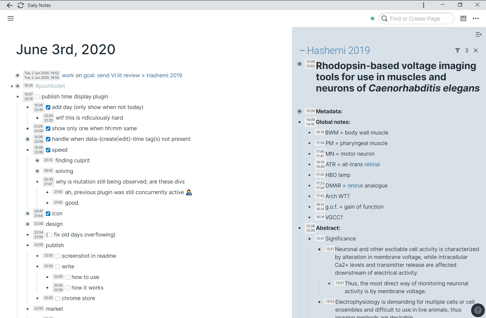

# RoamShowTime
Browser extension to show block creation & edit times on [RoamResearch.com](https://roamresearch.com).

What it looks like:

### Instructions

- Toggle the time display using `C-c C-x`.
- The top line is the creation time
- The bottom line is the last edit time
- If those are the same (ignoring seconds), only one line is displayed
- For times more than 24 hours in the past, the full date is displayed.

When a lot of blocks are loaded on the page, the app will start to respond slowly.
Toggling off the time display while you are interacting with blocks will then help.

### How it works

It's based on the feature described in [this tweet](https://twitter.com/Conaw/status/1265253941727465476):
> If you hit `C-c C-x` you'll get an edit icon for every block, with `data-create-time` and `data-edit-time` [attributes]  
> – @Conaw (May 26, 2020)

This extension
- listens for DOM mutations (e.g. collapse or editing of a block);
- [throttle](https://underscorejs.org/#throttle)s these events (so that the extension code does not run too often);
- on each (throttled) DOM mutation, finds all divs with a `data-edit-time` attribute, and replaces their contents with formatted timestamps, as in the screenshot above.
